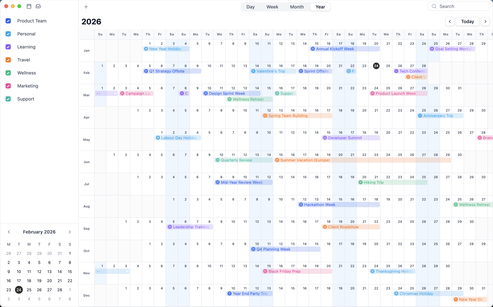
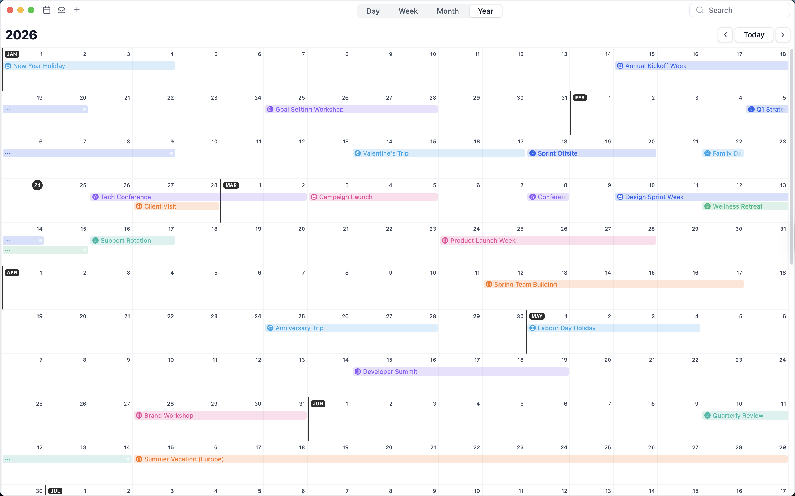
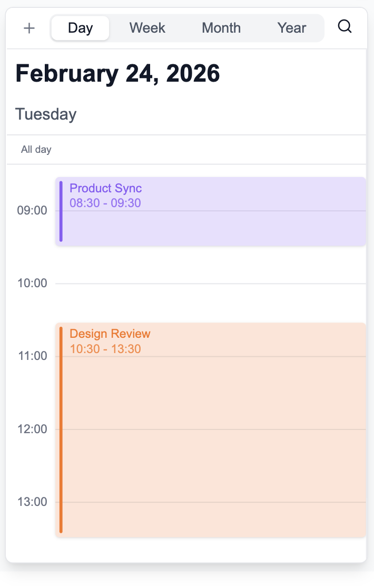
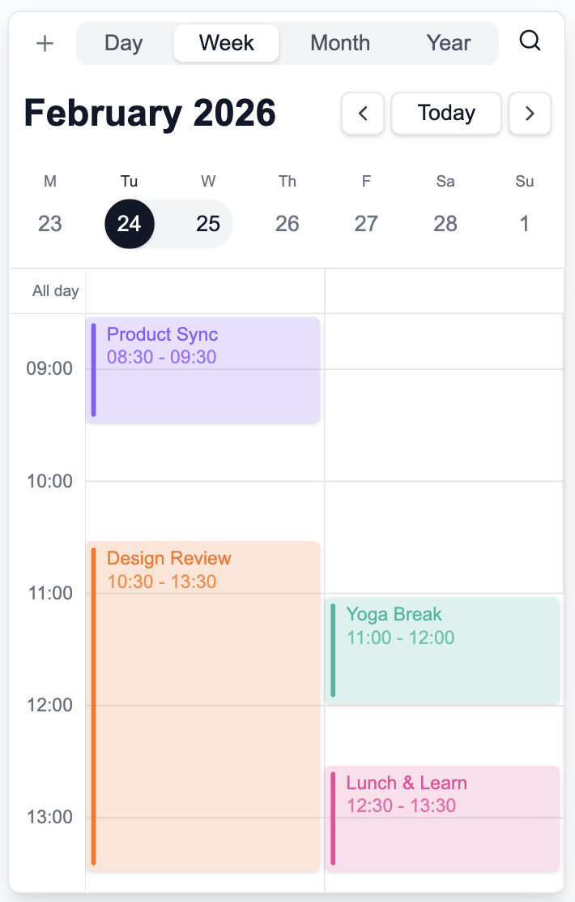
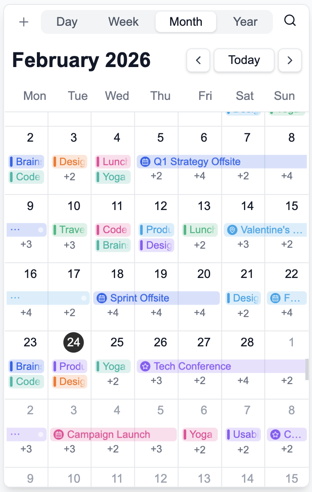
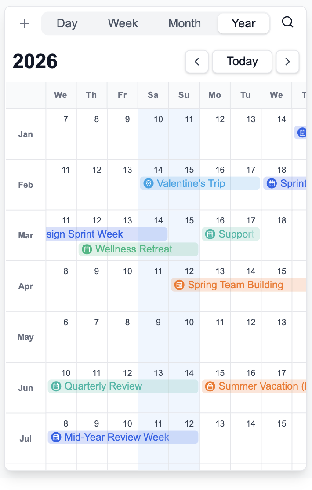
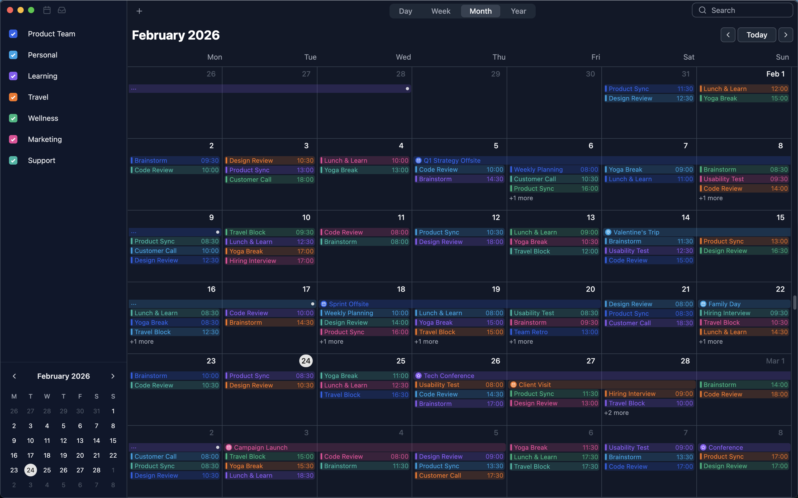

# DayFlow

[English](README.md) | [中文](README.zh.md) | **日本語** | [はじめに & コントリビューション](CONTRIBUTING.md)

ドラッグ＆ドロップ、マルチビュー、プラグインアーキテクチャをサポートする、柔軟で機能豊富なReactカレンダーコンポーネントライブラリ。

## 機能

### 日次、週次、月次、年次、その他のビュータイプ

#### 日次

#### 週次

#### 月次

#### 年次 (固定週)

#### 年次 (キャンバス)

### モバイルビューのサポート

#### モバイル日次

#### モバイル週次

#### モバイル月次

#### モバイル年次

### デフォルトパネル（複数のイベント詳細パネルオプションが利用可能）

#### 詳細ポップアップ

#### 詳細ダイアログ

### ダークモードのサポート

### ドラッグ＆ドロップとリサイズも簡単

https://github.com/user-attachments/assets/726a5232-35a8-4fe3-8e7b-4de07c455353

https://github.com/user-attachments/assets/957317e5-02d8-4419-a74b-62b7d191e347

## コントリビューション

コントリビューションは大歓迎です！お気軽に Pull Request を送信してください。

## バグ報告

バグを見つけた場合は、[GitHub Issues](https://github.com/dayflow-js/dayflow/issues) で問題を報告してください。

## サポート

質問やサポートについては、GitHub で Issue を開くか、Discord に参加してください。

---
