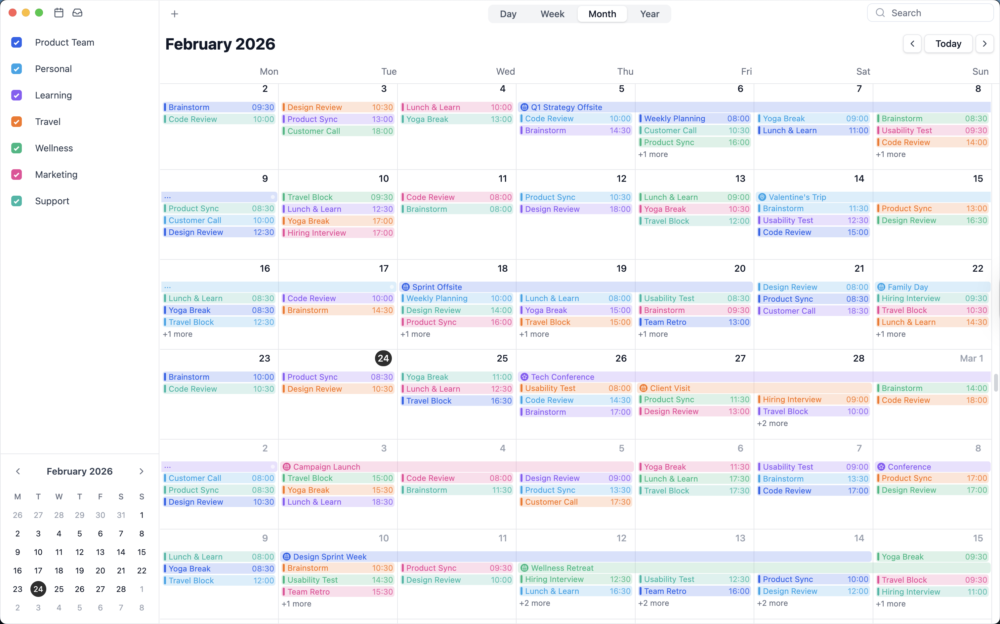
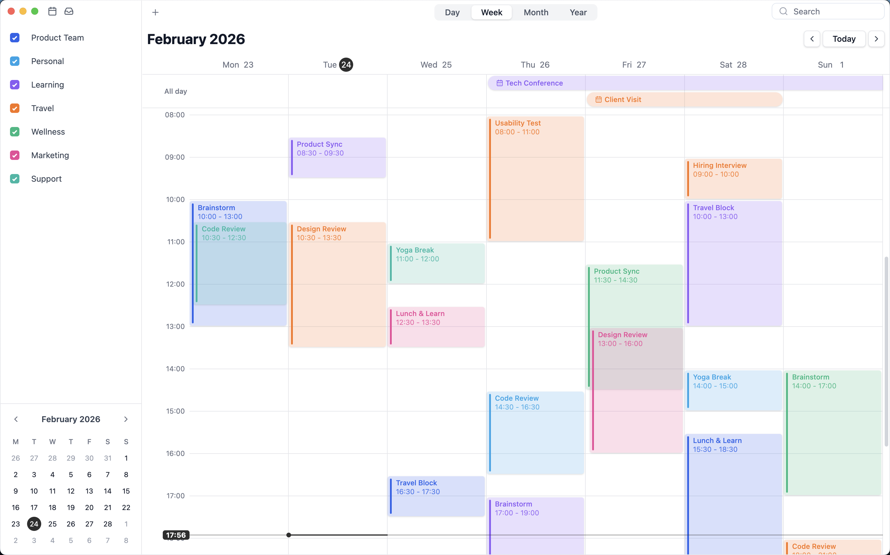
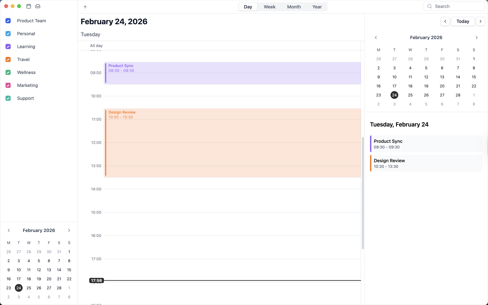
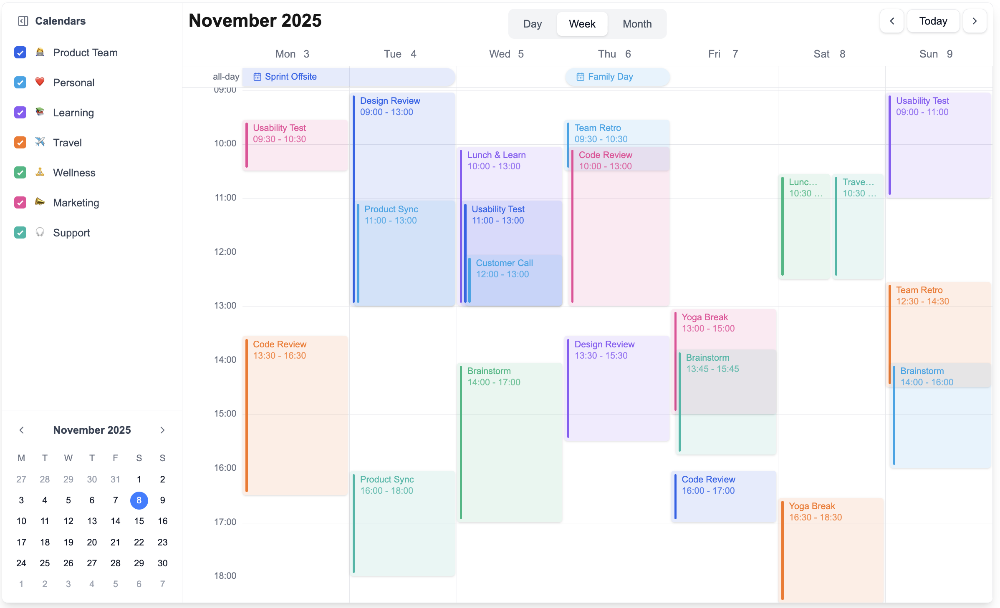
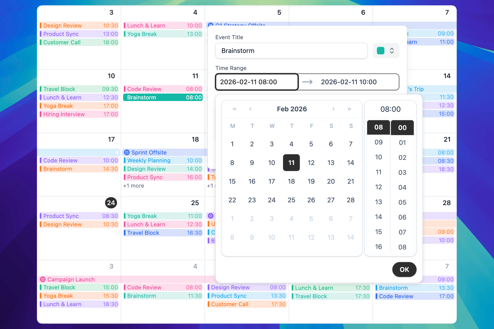
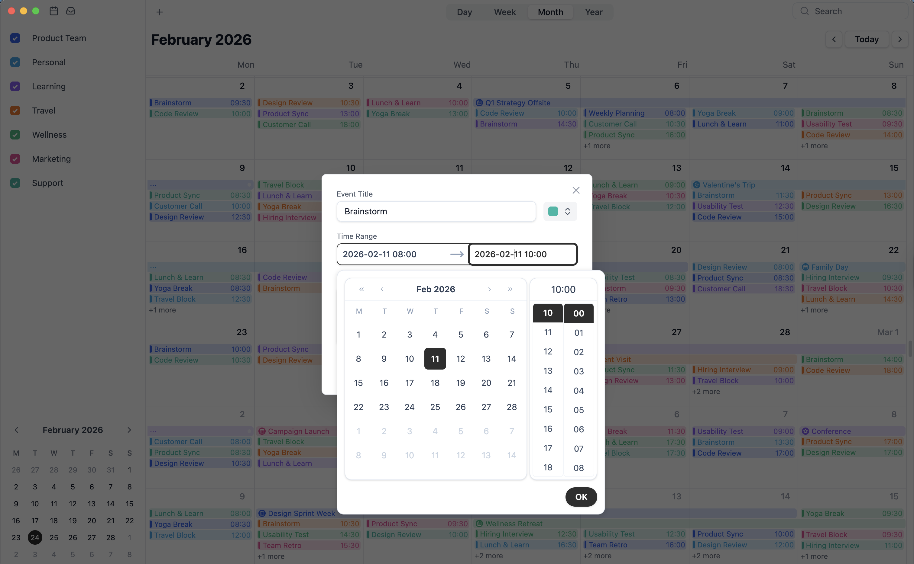

# DayFlow

A flexible and feature-rich calendar component library for React applications with drag-and-drop support, multiple views, and plugin architecture.

[](https://www.npmjs.com/package/@dayflow/core)
[](https://github.com/JayceV552/DayFlow/pulls)
[](https://github.com/JayceV552/DayFlow/blob/main/LICENSE)
[](https://discord.gg/jc37N4xw)

## 🗓️ Features

### ✨ Monthly, Weekly, Daily and Various View Types

| Monthly                                  | Weekly                                 |
| ---------------------------------------- | -------------------------------------- |
|  |  |

| Daily                                 | Event Stack Level                        |
| ------------------------------------- | ---------------------------------------- |
|  |  |

### 🤩 Default Panel (with multiple Event Detail Panel options available)

| Detail Popup                        | Detail Dialog                        |
| ----------------------------------- | ------------------------------------ |
|  |  |

### Easy to resize and drag

<div style="
  display: flex;
  justify-content: center;
  align-items: center;
  gap: 20px;
  flex-wrap: wrap;
">
  <video style="width: 45%; max-width: 640px;" controls autoplay muted playsinline>
    <source src="./assets/videos/Dayflow1.mp4" type="video/mp4">
  </video>

  <video style="width: 45%; max-width: 640px;" controls autoplay muted playsinline>
    <source src="./assets/videos/Dayflow2.mp4" type="video/mp4">
  </video>
</div>

## ✨ Core Features

- 🗓️ **Multiple Views**: Day, Week, Month, and Year views
- 🎨 **Customizable Styling**: Built with Tailwind CSS for easy customization
- 📱 **Responsive Design**: Works seamlessly on desktop, tablet, and mobile
- 🔌 **Plugin Architecture**: Extensible plugin system for custom functionality
- 🎯 **Drag & Drop Support**: Intuitive event management with drag and drop
- ⚡ **TypeScript Support**: Fully typed for better developer experience
- 🎨 **Event Management**: Create, update, delete, and organize events
- 🔄 **Virtual Scrolling**: High performance with large datasets
- 🎭 **Custom Renderers**: Customize event appearance and behavior

## 🚀 Additional Features

### 📅 Advanced Calendar Capabilities

- **Multi-Day Events**: Seamlessly span events across multiple days with visual continuity
- **All-Day Events**: Support for full-day events with dedicated header section
- **Event Stacking**: Intelligent event overlap detection with customizable stack levels
- **Sidebar Support**: Built-in sidebar component for calendar management

### 🎨 Customization & Theming

- **Custom Event Renderers**: Full control over event appearance with custom components
- **Color Coding**: Multiple calendar types with color-coded events (`calendarId` support)
- **Custom Detail Panels**: Three display modes - Dialog, Popup, or custom panel
- **Custom Headers**: Fully customizable `ViewHeader` component with switcher modes
- **Drag Indicators**: Customizable drag indicator renderers for different event types

### 🎯 Event Interaction

- **Event Callbacks**: `onEventCreate`, `onEventUpdate`, `onEventDelete` lifecycle hooks
- **Click Events**: Handle event clicks with custom callbacks
- **Drag & Drop**: Resize and move events with visual feedback
- **Color Picker**: Built-in color selection component for calendar types

### ⚡ Performance & Developer Experience

- **Virtual Scrolling**: High-performance rendering for large datasets in Month and Year views
- **TypeScript First**: Complete type definitions for all APIs
- **Plugin System**: Extensible architecture with Events Plugin and Drag Plugin
- **Temporal API**: Modern date/time handling with Temporal polyfill

## 📦 Installation

```bash
npm install @dayflow/core lucide-react
# or
yarn add @dayflow/core lucide-react
# or
pnpm add @dayflow/core lucide-react
```

### Peer Dependencies

- `react` >= 18.0.0
- `react-dom` >= 18.0.0
- `lucide-react` >= 0.400.0

## 🚀 Quick Start

```tsx
import { useCalendarApp, DayFlowCalendar } from '@dayflow/core';
import { createMonthView, createWeekView, createDayView } from '@dayflow/core';
import '@dayflow/core/dist/styles.css';

function App() {
  const calendar = useCalendarApp({
    views: [createMonthView(), createWeekView(), createDayView()],
    initialDate: new Date(),
  });

  return <DayFlowCalendar calendar={calendar} />;
}
```

> 📖 **[View Full Documentation →](https://dayflow-js.github.io/DayFlow/)**

## 🎯 Use Cases

DayFlow is perfect for:

- 📅 **Scheduling Applications**: Employee scheduling, appointment booking, class timetables
- 🎫 **Event Management**: Conference schedules, event calendars, festival planners
- 🏢 **Project Management**: Timeline views, task scheduling
- 💼 **Business**: Meeting rooms, resource booking, availability management

## 🌟 Key Highlights

- ✅ **TypeScript Support**: Full type definitions included
- ✅ **Drag & Drop**: Built-in drag and resize functionality
- ✅ **Virtual Scrolling**: Optimized rendering for large datasets
- ✅ **Plugin System**: Extensible with Events and Drag plugins
- ✅ **Modern React**: Hooks-based architecture (React 18+)
- ✅ **Tailwind CSS**: Easy styling customization

## 🤝 Contributing

Contributions are welcome! Please feel free to submit a Pull Request.

## 🐛 Bug Reports

If you find a bug, please file an issue on [GitHub Issues](https://github.com/JayceV552/DayFlow/issues).

## 📮 Support

For questions and support, please open an issue on GitHub or go to discord.

---

Made with ❤️ by Jayce Li
